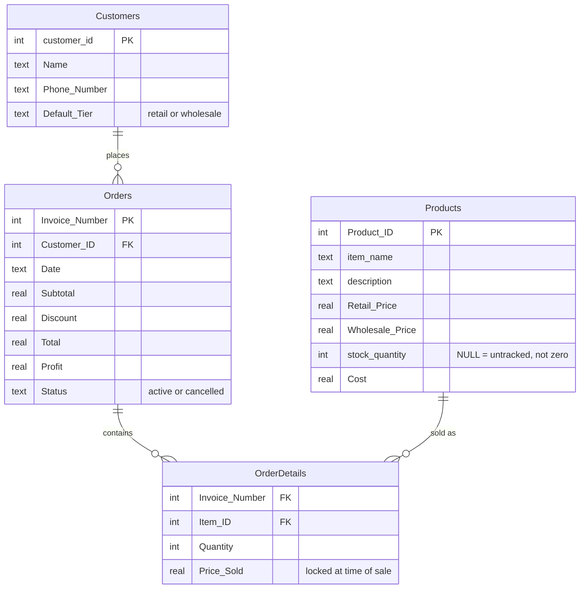
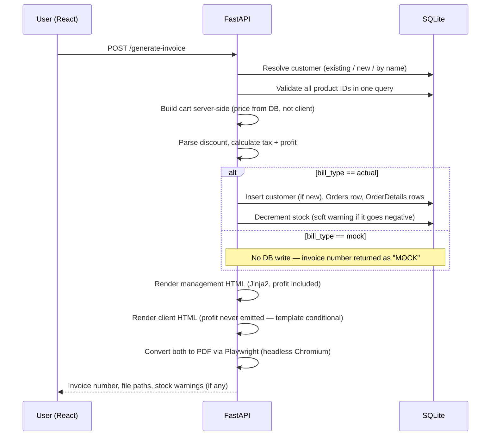

# Architecture Deep Dive

> **Note:** The primary visuals for this project are the hand-designed flowchart (`Docs/flowchart.png`) and database schema doc (`Docs/Database_Schema_v2.pdf`), linked from the main README. The diagrams below are a secondary, text-searchable reference  for reading inline without an image viewer, but not the polished versions.
>
> **I
## Database Schema

`Price_Sold` is deliberately denormalized — it's a snapshot of the price at the moment of sale, not a live reference to the product's current price. This keeps historical invoices accurate even after prices change later.

## The Invoice Generation Pipeline

## Every Endpoint

| Method | Path | Purpose |
|---|---|---|
| `GET` | `/customers` | List all customers |
| `GET` | `/customers/{id}` | Single customer |
| `POST` | `/customers` | Create customer |
| `GET` | `/products` | List all products |
| `GET` | `/products/{id}` | Single product |
| `POST` | `/products` | Create product |
| `PUT` | `/products/{id}` | Partial update — can explicitly null out stock to mark untracked |
| `DELETE` | `/products/{id}` | Delete — blocked if the product appears in any historical order |
| `GET` | `/dashboard/stats` | Top sellers, most profitable bills/customers, total profit |
| `GET` | `/orders` | Order list (for the sidebar picker) |
| `GET` | `/orders/{invoice_number}` | Full order detail with line items |
| `POST` | `/return-invoice` | Cancel an order — soft delete, profit zeroed, record kept |
| `POST` | `/generate-invoice` | The full pipeline above |

## The CLI / Pure Split

Every logic module (`customers.py`, `products.py`, `cart.py`, `financials.py`, `process.py`) contains two versions of its core functions:

- **CLI version** — the original terminal-tool function, uses `input()` to prompt and loop on bad input, prints directly to the console.
- **`_pure` version** — takes an explicit cursor/connection argument, raises exceptions instead of looping, returns data instead of printing. This is what FastAPI calls.

`functions.py` itself contains no logic — it's a re-export barrel so nothing importing from the original monolithic file broke when it was split into these modules.

## Return / Cancellation

Cancelling an order:
1. Sets `Orders.Status = 'cancelled'`
2. Zeroes `Orders.Profit` — every dashboard aggregate explicitly excludes cancelled orders from profit totals
3. Restores stock for each line item (if stock tracking is on)
4. **Never deletes the order, its line items, or its invoice number** — the historical record stays intact permanently